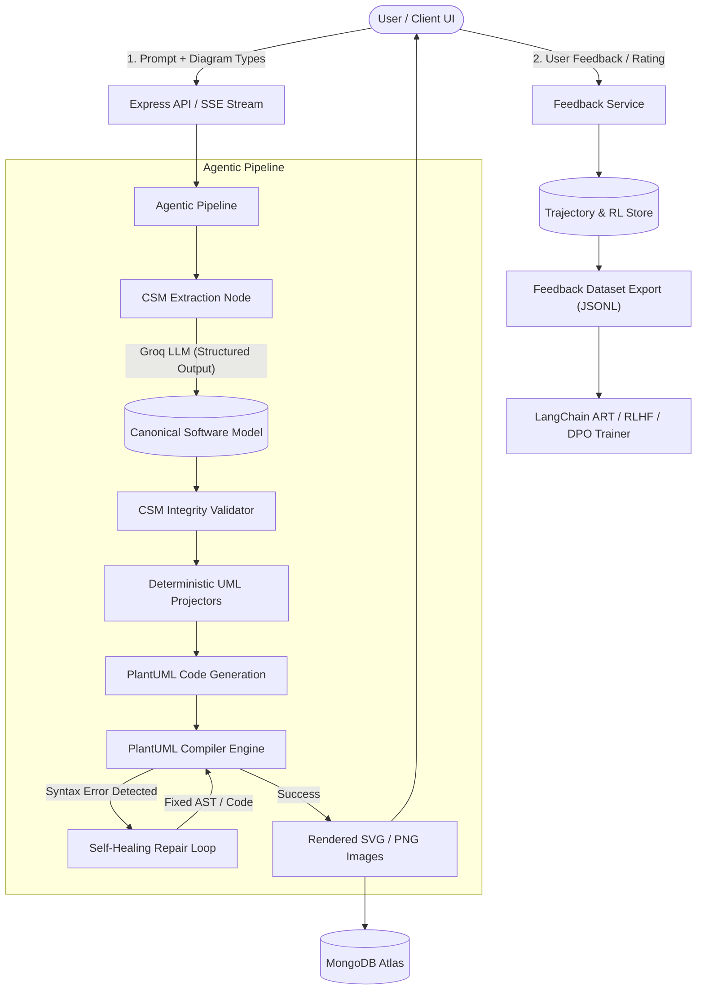

# 🚀 Agentic UML Generator

An intelligent, multi-turn AI-powered software architecture platform that transforms natural language software requirements into verified, high-fidelity **UML 2.x diagrams**.

Built with a **Canonical Software Model (CSM)** approach, deterministic projectors, automated self-healing syntax repair loops, and an **Adaptive Refinement & Training (ART)** reinforcement learning feedback system.

---

## 🌟 Key Highlights

- **🧠 Canonical Software Model (CSM)**: Extracts a unified, structured architecture model from user prompts to ensure consistent domain concepts across every diagram type.
- **📐 Complete UML 2.x Support**: Out-of-the-box support for all 14 standard UML 2.x structure and behavior diagram types.
- **⚡ Deterministic Projectors & Low Latency**: Translates structured CSM data into valid PlantUML using type-safe deterministic TypeScript projectors, minimizing hallucinations and latency.
- **🛡️ Self-Healing PlantUML Verification**: Compiles diagrams with PlantUML backend validation and automatically repairs syntax errors before returning results to the client.
- **🔄 Multi-Turn Iterative Refinement**: Supports conversational updates, incremental prompt edits, and instant diagram view-switching without re-computing unchanged architecture state.
- **🎯 ART & Reinforcement Learning (RL) Dataset Exporter**: Records full execution trajectories (prompts, completions, tool calls, reasoning steps, latencies) and exports feedback as JSONL for RLHF / DPO / GRPO fine-tuning.
- **📡 Real-Time SSE Pipeline Streaming**: Live status events streamed to the UI as extraction, projection, validation, and rendering steps execute.
- **🎨 Interactive Canvas & Studio UI**: Modern React frontend with pan, zoom, full-screen mode, PlantUML code preview, instant copy, and PNG/SVG export capabilities.

---

## 🗺️ Supported UML 2.x Diagram Types

| Category | Diagram Type | Description & Primary Use Case |
| :--- | :--- | :--- |
| **Structure** | **Class** | Domain and API models, class hierarchies, attributes, operations, and relationships. |
| **Structure** | **Object** | Runtime instance snapshots, test fixture representations, and object graphs. |
| **Structure** | **Component** | High-level architectural building blocks, subsystems, and provided/required ports. |
| **Structure** | **Composite Structure**| Internal wiring, parts, ports, and connectors within a component or class. |
| **Structure** | **Deployment** | Infrastructure topology, container runtime environments, nodes, and artifacts. |
| **Structure** | **Package** | Modular breakdown, namespace hierarchies, and package-level dependencies. |
| **Structure** | **Profile** | Stereotypes, tagged values, and domain-specific metamodel extensions. |
| **Behavior** | **Use Case** | Actor goals, system boundaries, and user interactions. |
| **Behavior** | **Activity** | Workflow pipelines, business processes, forks/joins, and decision logic. |
| **Behavior** | **State Machine** | Entity lifecycles, state transitions, events, actions, and guard conditions. |
| **Behavior (Interaction)** | **Sequence** | Chronological message flows, async/sync calls, alt blocks, and lifelines. |
| **Behavior (Interaction)** | **Communication** | Structural interactions focusing on participant relationships and numbered messages. |
| **Behavior (Interaction)** | **Interaction Overview**| High-level control-flow connecting multiple sequence diagrams. |
| **Behavior (Interaction)** | **Timing** | State and condition changes along a continuous timeline for real-time systems. |

---

## 🏗️ System Architecture



---

## 💻 Tech Stack

### Frontend (`/client`)
- **Framework**: React 19 + TypeScript + Vite
- **Icons**: Lucide React
- **Styling**: Modern responsive CSS design system with dark mode accents
- **Features**: Interactive zoom/pan canvas, real-time SSE progress indicators, PlantUML code modal, export utilities, feedback collection

### Backend (`/server`)
- **Runtime**: Node.js (ES Modules) + Express 5 + TypeScript
- **Database**: MongoDB with Mongoose (Sessions, Diagrams, Trajectories, Feedback)
- **LLM Integration**: Groq SDK (`openai/gpt-oss-120b`, `openai/gpt-oss-20b`) with JSON schema constrained decoding
- **Concurrency & Resilience**: `p-limit`, `p-retry`
- **UML Engine**: Dual backend support:
  - Local Java `plantuml.jar` execution
  - Remote / Docker PlantUML HTTP Server
- **Testing**: Vitest for unit, integration, and projector snapshot testing

---

## 📁 Repository Structure

```
umlgenerator/
├── client/                     # Frontend Application
│   ├── src/
│   │   ├── App.tsx             # Main UML Studio Application & Canvas
│   │   ├── App.css             # Studio UI Styles & Animations
│   │   ├── services/           # API and SSE client services
│   │   └── types/              # Frontend TypeScript contracts
│   ├── package.json
│   └── vite.config.ts
├── server/                     # Backend Application
│   ├── src/
│   │   ├── agent/              # Agentic pipeline, LLM nodes, CSM integrity & schemas
│   │   ├── config/             # Database and environment configurations
│   │   ├── controllers/        # Diagram, session, image, and feedback controllers
│   │   ├── models/             # Mongoose schemas (Diagram, Session, Trajectory, Feedback)
│   │   ├── plantuml/           # PlantUML rendering engine & JAR/Server abstractions
│   │   ├── projectors/         # 14 Deterministic CSM -> PlantUML Projectors
│   │   ├── routes/             # REST endpoints for diagrams, sessions, and feedback
│   │   ├── sse/                # Server-Sent Events broadcasting
│   │   ├── app.ts              # Express application factory
│   │   └── server.ts           # Server bootstrap
│   ├── scripts/
│   │   └── fetch-plantuml.mjs  # Automation script to fetch latest PlantUML jar
│   ├── test/                   # Vitest test suite
│   ├── .env.example
│   └── package.json
└── README.md
```

---

## 🚀 Getting Started

### Prerequisites
- **Node.js**: v18+ (v20+ recommended)
- **npm** or **pnpm**
- **Java JRE/JDK** (version 11+ for local `plantuml.jar`) *or* Docker for PlantUML Server
- **MongoDB**: Local instance or MongoDB Atlas connection string
- **Groq API Key**: Obtainable from [console.groq.com](https://console.groq.com/keys)

---

### 1. Backend Setup

1. Open a terminal and navigate to `server`:
   ```bash
   cd server
   ```

2. Install dependencies:
   ```bash
   npm install
   ```

3. Download the local PlantUML binary:
   ```bash
   npm run fetch:plantuml
   ```

4. Create your `.env` configuration:
   ```bash
   cp .env.example .env
   ```

   Edit `.env` with your credentials:
   ```env
   PORT=5001
   NODE_ENV=development
   MONGODB_URI=mongodb://localhost:27017/umlgenerator
   GROQ_API_KEY=gsk_your_actual_groq_api_key_here
   
   MODEL_PRIMARY=openai/gpt-oss-120b
   MODEL_FAST=openai/gpt-oss-20b
   
   PLANTUML_BACKEND=jar
   PLANTUML_JAR=vendor/plantuml.jar
   JAVA_BIN=java
   ```

5. Start the backend development server:
   ```bash
   npm run dev
   ```
   The backend will be running at `http://localhost:5001`.

---

### 2. Frontend Setup

1. Open another terminal and navigate to `client`:
   ```bash
   cd client
   ```

2. Install dependencies:
   ```bash
   npm install
   ```

3. Start the Vite development server:
   ```bash
   npm run dev
   ```
   The application UI will be accessible at `http://localhost:5173`.

---

## 🧪 Testing

Run test suites for projectors, CSM integrity validation, and API routes:

```bash
cd server
npm test
```

For watch mode during development:
```bash
npm run test:watch
```

---

## 📡 API Reference

### Health Check
- `GET /api/health` — Checks status of MongoDB, PlantUML engine, and Groq configuration.

### Diagrams & Generation
- `GET /api/diagram-types` — Returns metadata for all 14 supported UML diagram types.
- `POST /api/diagrams/generate/:sessionId` — Initiates multi-diagram generation pipeline with SSE stream output.
- `POST /api/diagrams/switch-view/:sessionId` — Instantly projects and renders an alternate diagram type from the existing CSM.
- `GET /api/diagrams/:sessionId` — Retrieves all generated diagrams for a given session.
- `GET /api/diagram/:session/:filename` — Serves rendered SVG / PNG diagram assets.

### Sessions
- `GET /api/sessions/:sessionId` — Fetches session details and generation history.
- `GET /api/sessions/:sessionId/model` — Returns the current Canonical Software Model (CSM) JSON.
- `DELETE /api/sessions/:sessionId` — Deletes session and associated diagrams.

### Feedback & Reinforcement Learning (RL)
- `POST /api/feedback` — Submits rating (`thumbs_up` / `thumbs_down`) and optional corrective comments.
- `GET /api/feedback/export` — Streams JSONL dataset with full trajectories and scalar rewards for LangChain ART / GRPO fine-tuning.

---

## 🧠 Reinforcement Learning & ART Dataset Export

Every generation run logs its trajectory into MongoDB:
- System and user prompts
- Model reasoning and completions
- Output schemas and latency metrics
- Applied reward signals (+1.0 for thumbs up, -1.0 for thumbs down, averaged for shared CSM extraction turns)

To export the training set:
```bash
curl -X GET "http://localhost:5001/api/feedback/export" -o rl_training_data.jsonl
```

The resulting `rl_training_data.jsonl` is ready to be consumed directly by RL fine-tuning trainers (DPO, PPO, GRPO, or LangChain ART).

---

## 📄 License

This project is licensed under the [ISC License](LICENSE).
